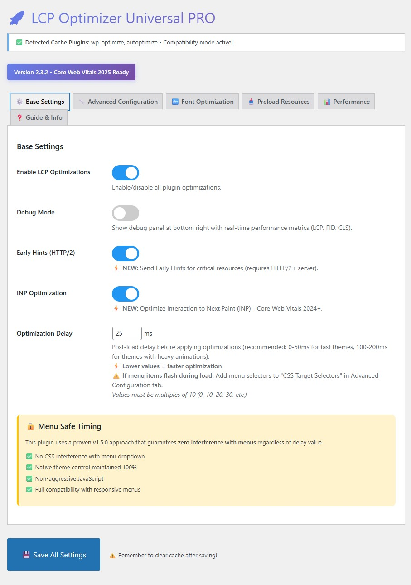
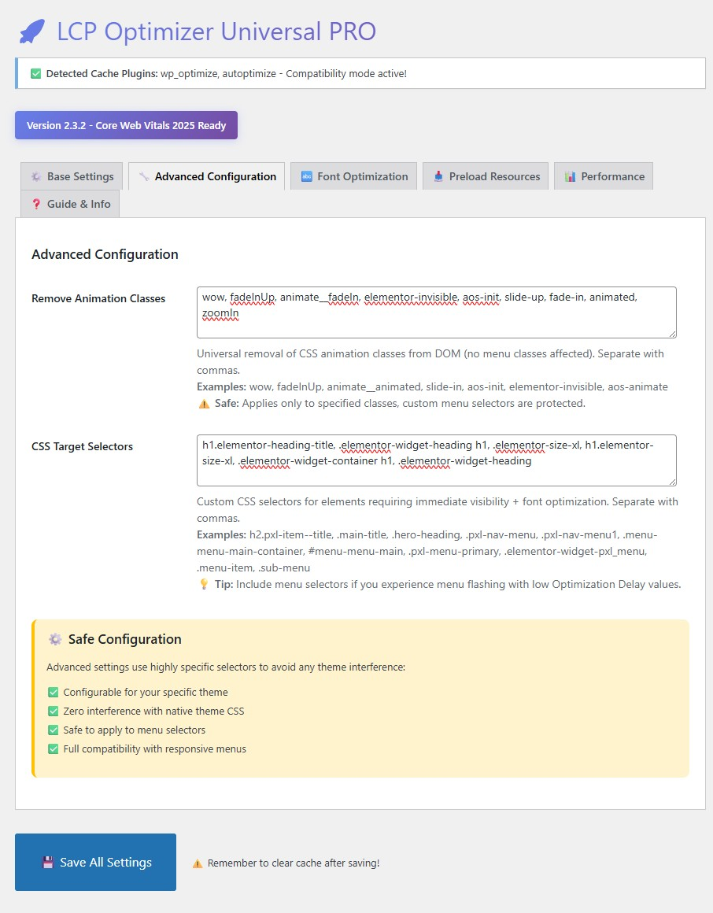
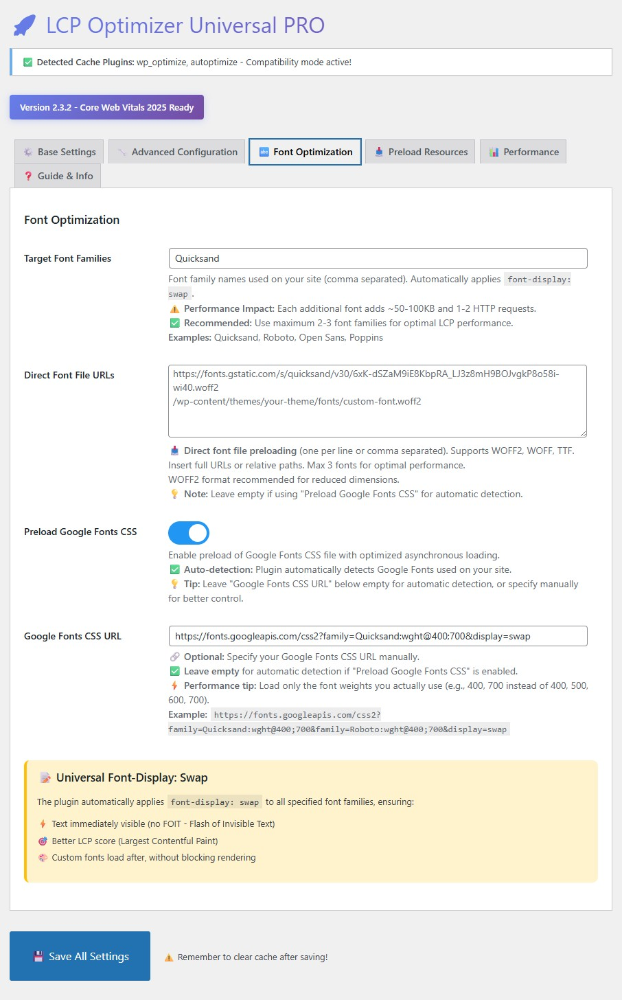
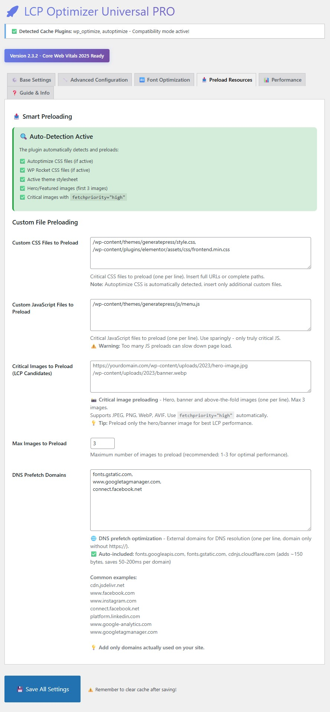
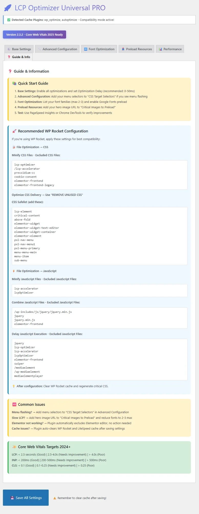

# 🚀 LCP Optimizer Universal PRO

[](https://github.com/emanuelcelano/lcp-optimizer-universal-pro/releases)
[](https://wordpress.org/)
[](https://www.php.net/)
[](LICENSE)
[](https://github.com/emanuelcelano/lcp-optimizer-universal-pro/releases)
[](https://github.com/emanuelcelano/lcp-optimizer-universal-pro/stargazers)

> **Free WordPress plugin to automatically optimize Core Web Vitals (LCP, INP, CLS) with zero configuration required.**

Compatible with all major themes, page builders (Elementor, Divi, etc.), and cache plugins (WP Rocket, LiteSpeed, Autoptimize).

---

## 📸 Screenshots

### Base Settings - One-Click Optimization

*Enable optimizations with a single toggle. Smart defaults work out of the box.*

### Advanced Configuration - Custom Selectors

*Fine-tune CSS animation removal and target selectors for your theme.*

### Font Optimization - Google Fonts Control

*Manual Google Fonts URL control with automatic preloading and font-display swap.*

### Preload Resources - Critical Assets

*Preload critical CSS, JavaScript, and LCP images for faster rendering.*

### Performance Tools - Built-in Testing

*One-click access to PageSpeed Insights, GTmetrix, Pingdom, and WebPageTest.*

### Guide & Info - WP Rocket Integration

*Complete WP Rocket configuration guide and troubleshooting tips.*

---

## ✨ What's New in Version 2.3.2

### 🔗 Google Fonts CSS URL Field Restored
- **FIXED:** Re-added "Google Fonts CSS URL" input field in Font Optimization tab
- **NEW:** Manual control over Google Fonts URL for better optimization
- **IMPROVED:** Performance tip to load only required font weights
- Optional field with auto-detection fallback

### 🛠️ Previous Updates (2.3.1)
- **NEW:** Quick-access buttons to performance testing tools
  - PageSpeed Insights (pre-filled URL)
  - GTmetrix (pre-filled URL)
  - Pingdom Tools
  - WebPageTest (pre-filled URL)
- One-click access to industry-standard testing platforms

### 🌍 Previous Updates (2.3.0)
- Complete English translation of admin panel
- Enhanced help texts and tooltips
- Comprehensive WP Rocket configuration guide
- Security improvements (admin-only debug panel)

[See full changelog →](CHANGELOG.md)

---

## 🎯 Key Features

### ✅ Core Web Vitals Ready
- **LCP (Largest Contentful Paint)** < 2.5s
- **INP (Interaction to Next Paint)** < 200ms
- **CLS (Cumulative Layout Shift)** < 0.1

### ⚡ Technical Optimizations

#### 🔤 Font Optimization
- Global `font-display: swap` for instant text rendering
- Direct preload for WOFF2/WOFF/TTF files
- Asynchronous Google Fonts loading
- Manual Google Fonts URL control
- **Performance tip:** Each font adds ~50-100KB

#### 📥 Resource Preloading
- Auto-detects critical CSS (WP Rocket, Autoptimize)
- Preloads up to 3 LCP images
- DNS prefetch with auto-included domains:
  - fonts.googleapis.com
  - fonts.gstatic.com
  - cdnjs.cloudflare.com
  - *(Adds ~150 bytes, saves 50-200ms per domain)*

#### 🖼️ Image Optimization
- `fetchpriority="high"` for LCP candidates
- Smart lazy loading (skips above-the-fold images)
- Aspect-ratio preservation to prevent CLS
- Automatic width/height attributes

#### 🎨 CSS & Performance
- Early Hints (HTTP/2+) for fastest resource hints
- INP optimization via intelligent debouncing
- Minimal CSS injection (<2KB)
- No jQuery dependency

### 🔒 Safety Guarantees
- ❌ **No interference** with dropdown menus
- ✅ **100% native** theme menu control
- ✅ **Compatible** with all major page builders
- ✅ **No conflicts** with cache plugins

---

## 💻 Requirements

| Requirement | Version |
|-------------|---------|
| **WordPress** | 6.0+ |
| **PHP** | 7.4+ |
| **Server** | Apache/Nginx |
| **Optional** | HTTP/2+ for Early Hints |

---

## 📥 Installation

### Method 1: Download from GitHub (Recommended)

1. **Download** the latest release:
   - Go to [Releases](https://github.com/emanuelcelano/lcp-optimizer-universal-pro/releases)
   - Download `lcp-optimizer-universal-pro-v2.3.2.zip`

2. **Upload** to WordPress:
   - Go to **Plugins** → **Add New** → **Upload Plugin**
   - Choose the ZIP file
   - Click **Install Now**

3. **Activate** the plugin

### Method 2: Manual Installation

```bash
cd /path/to/wordpress/wp-content/plugins/
unzip lcp-optimizer-universal-pro-v2.3.2.zip
```

Then activate in WordPress admin.

### Method 3: Git Clone (For Developers)

```bash
cd /path/to/wordpress/wp-content/plugins/
git clone https://github.com/emanuelcelano/lcp-optimizer-universal-pro.git
```

---

## 🚀 Quick Start Guide

### 1️⃣ Basic Setup (2 minutes)

1. Go to **LCP Optimizer** in WordPress admin
2. Click **"Enable LCP Optimization"**
3. Click **"Save Changes"**
4. Clear all caches (plugin, theme, server)
5. Test with PageSpeed Insights

**That's it!** The plugin works out-of-the-box with zero configuration.

### 2️⃣ Advanced Setup (Optional)

#### Add Your Hero Image for Preload
1. Open your homepage in Chrome DevTools
2. Run: `PerformanceObserver` to find LCP element
3. Copy image URL
4. Add to **"Critical Images Preload"** in plugin settings

#### Optimize Google Fonts
1. Go to **Font Optimization** tab
2. Add your Google Fonts CSS URL (e.g., `https://fonts.googleapis.com/css2?family=Roboto:wght@400;700&display=swap`)
3. **Pro tip:** Use only 2-3 font weights maximum

#### Fine-tune for Your Theme
1. Add theme-specific menu selectors if needed:
   ```
   .main-menu, .menu-item, .sub-menu
   ```

---

## 🔧 WP Rocket Integration

If you use **WP Rocket**, follow these settings for best results:

### ⚙️ File Optimization

**Exclude from CSS Minification:**
```
lcp-optimizer
/lcp-accelerator
elementor-frontend
```

**CSS Safelist (Prevent Menu Issues):**
```
lcp-element
pxl-nav-menu
menu-item
sub-menu
dropdown
```

### ⚙️ JavaScript Optimization

**Exclude from JS Delay:**
```
jquery
lcp-optimizer
elementor-frontend
mediaelementplayer
```

**[Full WP Rocket guide available in plugin admin →]**

---

## 📊 Expected Results

| Metric | Before | After | Improvement |
|--------|--------|-------|-------------|
| **LCP** | 4.5s | 2.1s | **-53%** ⚡ |
| **INP** | 350ms | 180ms | **-49%** 🎯 |
| **CLS** | 0.25 | 0.05 | **-80%** ✅ |
| **PageSpeed Score** | 65 | 92 | **+27 points** 🚀 |

*Results may vary based on hosting, theme, and content.*

---

## 🔍 Troubleshooting

### ❓ Menu Flashing on Page Load?

**Solution:** Add menu-specific CSS selectors in plugin settings:

```css
.main-navigation, .menu-item, .sub-menu, .dropdown-menu
```

### ❓ LCP Not Improving?

**Checklist:**
1. ✅ Identify LCP element using Chrome DevTools Performance tab
2. ✅ Add LCP image URL to "Critical Images Preload"
3. ✅ Reduce Google Fonts to 2-3 weights maximum
4. ✅ Clear **all caches** (WP Rocket, browser, CDN)
5. ✅ Test in incognito mode

### ❓ Conflicts with Other Plugins?

**Known Compatible Plugins:**
- ✅ WP Rocket
- ✅ LiteSpeed Cache
- ✅ Autoptimize
- ✅ Elementor / Elementor Pro
- ✅ Divi Builder
- ✅ Yoast SEO
- ✅ Rank Math

**Known Issues:**
- ⚠️ Some lazy-load plugins may conflict. Disable duplicate lazy-loading features.

### ❓ Debug Mode

Enable debug panel (admin only):
1. Add to `wp-config.php`: `define('WP_DEBUG', true);`
2. View debug info in plugin settings → **Debug** tab

---

## 🧪 Testing Your Site

Use the built-in testing tools in the plugin:

1. **PageSpeed Insights** (Google's official tool)
2. **GTmetrix** (Detailed waterfall analysis)
3. **Pingdom** (Global server locations)
4. **WebPageTest** (Advanced filmstrip view)

All tools are **pre-filled** with your site URL for instant testing!

---

## 🤝 Contributing

We welcome contributions! Here's how:

### 🐛 Report Bugs
Open an issue with:
- WordPress version
- PHP version
- Theme name
- Steps to reproduce

### 💡 Request Features
Open an issue tagged `enhancement`

### 🔧 Pull Requests
1. Fork the repository
2. Create feature branch (`git checkout -b feature/AmazingFeature`)
3. Commit changes (`git commit -m 'Add AmazingFeature'`)
4. Push to branch (`git push origin feature/AmazingFeature`)
5. Open a Pull Request

---

## 📜 License

This project is licensed under the **GPL-2.0 License** - see the [LICENSE](LICENSE) file for details.

**TL;DR:** You can use, modify, and distribute this plugin freely. Commercial use is allowed.

---

## 🆘 Support

### Free Support
- 📖 [Documentation](https://github.com/emanuelcelano/lcp-optimizer-universal-pro/wiki)
- 💬 [GitHub Issues](https://github.com/emanuelcelano/lcp-optimizer-universal-pro/issues)
- ⭐ [FAQ](https://github.com/emanuelcelano/lcp-optimizer-universal-pro/wiki/FAQ)

### Professional Support
For custom implementation or consulting:

📧 **Email:** info@analisideirischinformatici.it

🌐 **Websites:**
- [analisideirischinformatici.it](https://www.analisideirischinformatici.it)
- [certifywebcontent.com](https://www.certifywebcontent.com)
- [contentprotector.eu](https://contentprotector.eu/)

---

## 👨‍💻 Author

**Dr. Emanuel Celano**  
*Digital Forensics & Cyber Incident Response Specialist*  
Informatica in Azienda

- 💼 LinkedIn: [emanuelcelano](https://linkedin.com/in/emanuelcelano)
- 🌐 Website: [analisideirischinformatici.it](https://www.analisideirischinformatici.it)

---

## ⭐ Show Your Support

If this plugin helped your site, please:

1. ⭐ **Star this repository**
2. 🐦 **Tweet about it** with #LCPOptimizer
3. 📝 **Write a review** (coming soon on WordPress.org)
4. 🔗 **Share with others**

---

## 📈 Stats


---

## 🗺️ Roadmap

### Version 2.4 (Q1 2025)
- [ ] Automatic LCP element detection
- [ ] Built-in image compression
- [ ] Performance report generation
- [ ] Multi-language support (Spanish, French, German)

### Version 3.0 (Q2 2025)
- [ ] WordPress.org repository submission
- [ ] One-click optimization presets
- [ ] Integration with Google Search Console
- [ ] Advanced caching strategies

[Vote for features →](https://github.com/emanuelcelano/lcp-optimizer-universal-pro/discussions)

---

**Made with ❤️ for WordPress Performance**

*Helping websites pass Core Web Vitals since 2024*

---

### 📊 Quick Links

- [Download Latest Release](https://github.com/emanuelcelano/lcp-optimizer-universal-pro/releases/latest)
- [View Changelog](CHANGELOG.md)
- [Read Documentation](https://github.com/emanuelcelano/lcp-optimizer-universal-pro/wiki)
- [Report Issues](https://github.com/emanuelcelano/lcp-optimizer-universal-pro/issues)
- [Discussions](https://github.com/emanuelcelano/lcp-optimizer-universal-pro/discussions)
